# Plan de Trabajo Estructurado: Resolución del Reto Técnico (24 Horas)

Este documento define la metodología y el flujo de trabajo paso a paso que seguiremos desde el momento en que se reciba el reto técnico. El objetivo es garantizar la máxima calidad de código, rigor científico, reproducibilidad y modularidad dentro del límite de 24 horas.

---

## ⏱️ Cronograma de Ejecución Propuesto

El tiempo se divide en fases consecutivas, asegurando tener un producto funcional (MVP) muy temprano para luego iterar y pulir.

```mermaid
gantt
    title Cronograma de Trabajo (24 Horas)
    dateFormat  X
    axisFormat %Hh
    section Fase 1: Ingesta
    Requisitos e Inicialización : 0, 1
    section Fase 2: Diseño
    Estudio y Comparación de Enfoques : 1, 3
    section Fase 3: MVP
    Construcción del Pipeline e IA : 3, 8
    section Fase 4: Tests
    Pruebas Unitarias y Casos Límite : 8, 12
    section Fase 5: Métricas
    Observabilidad y Evaluación : 12, 16
    section Fase 6: Docs
    README.md y Documentación Final : 16, 20
    section Fase 7: Cierre
    Revisión de Código y Entrega : 20, 24
```

---

## 📋 Detalle de las Fases

### 🔍 Fase 1: Recepción e Ingesta del Reto (Hora 0 - 1)
* **Acción**: Crear el archivo `REQUISITOS.md` en la raíz del proyecto.
* **Contenido**:
  * **Requisitos Funcionales**: ¿Qué debe hacer la aplicación exactamente?
  * **Requisitos Técnicos**: Tecnologías solicitadas u obligatorias.
  * **Restricciones**: Límites de hardware, APIs, formatos de datos.
  * **Métricas de Éxito**: Cómo se medirá el desempeño (ej. exactitud, latencia, fidelidad de respuesta).

### 📐 Fase 2: Análisis y Diseño Arquitectural (Hora 1 - 3)
* **Acción**: Investigar y comparar enfoques antes de escribir código.
* **Contenido**:
  * **Comparativa de Arquitecturas**: Plantear al menos 2 formas de resolver el reto (ej. RAG básico vs RAG jerárquico; o Red Convolucional simple vs Transfer Learning con ResNet).
  * **Matriz de Decisión**: Comparar tecnologías candidatas (ej. FAISS vs Chroma; LangChain vs LlamaIndex) en función de:
    1. Tiempo de desarrollo en 24h.
    2. Rendimiento local (CPU/MPS).
    3. Simplicidad de instalación.
  * **Justificación**: Explicar por escrito en `REQUISITOS.md` por qué se elige el enfoque final.

### 🛠️ Fase 3: Construcción del MVP y Pipeline de Datos (Hora 3 - 8)
* **Acción**: Desarrollar el núcleo de la solución de forma modular bajo la carpeta `src/`.
* **Pasos**:
  1. **Pipeline de Ingesta**: Carga, limpieza y formateo de datos.
  2. **Pipeline de Modelado/IA**: Carga del modelo, embeddings, configuración del indexador vectorial o definición de la red en PyTorch.
  3. **Script Principal (`main.py`)**: Script orquestador que conecte todo el flujo.

### 🧪 Fase 4: Pruebas Unitarias y Casos Límite (Hora 8 - 12)
* **Acción**: Implementar pruebas automáticas para demostrar robustez a nivel de producción.
* **Pasos**:
  * Configurar `pytest` en la carpeta `tests/`.
  * **Casos de Prueba**:
    * **Flujo Feliz (Happy Path)**: Entradas válidas estándar.
    * **Casos Límite (Edge Cases)**: Inputs vacíos, strings excesivamente largos, datos nulos en DataFrames, formato de datos no compatible.
    * **Pruebas de Integración**: Validar que el recuperador vectorial devuelve documentos coherentes con la consulta.

### 📊 Fase 5: Observabilidad y Evaluación (Hora 12 - 16)
* **Acción**: Instrumentar el código para medir su comportamiento.
* **Pasos**:
  * **Logging**: Implementar `logging` estructurado en consola y archivo `.log`.
  * **Métricas de Rendimiento**: Registrar tiempos de ejecución de las partes críticas (ej. tiempo de indexación, latencia del LLM por token, tiempo de entrenamiento por época).
  * **Reporte de Evaluación**: Generar un script que ejecute una batería de pruebas de evaluación (ej. matriz de confusión para clasificación; porcentaje de recuperación correcta para RAG) y exporte las gráficas.

### ✍️ Fase 6: Documentación y Empaquetado (Hora 16 - 20)
* **Acción**: Crear un `README.md` impecable orientado a los evaluadores técnicos.
* **Secciones Obligatorias**:
  1. **Descripción del Proyecto**: Propósito y contexto.
  2. **Instalación y Configuración**: Instrucciones exactas para levantar el entorno virtual e instalar dependencias.
  3. **Instrucciones de Ejecución**: Comandos claros para entrenar, evaluar o consultar el sistema.
  4. **Decisiones de Diseño**: Por qué se estructuró así el código y por qué se eligieron esas librerías.
  5. **Métricas de Evaluación**: Resultados obtenidos.
  6. **Siguientes Pasos**: Qué se mejoraría con más de 24 horas (demuestra visión de producto).

### 🚀 Fase 7: Revisión de Código y Entrega (Hora 20 - 24)
* **Acción**: Asegurar la calidad estética y funcional del código.
* **Pasos**:
  * Ejecutar formateadores y linters (`black`, `flake8`, `mypy`).
  * Hacer git status y verificar que no se suban archivos basura o pesados.
  * Realizar el push final a la rama principal de GitHub y comprobar que se visualice correctamente en la plataforma.
